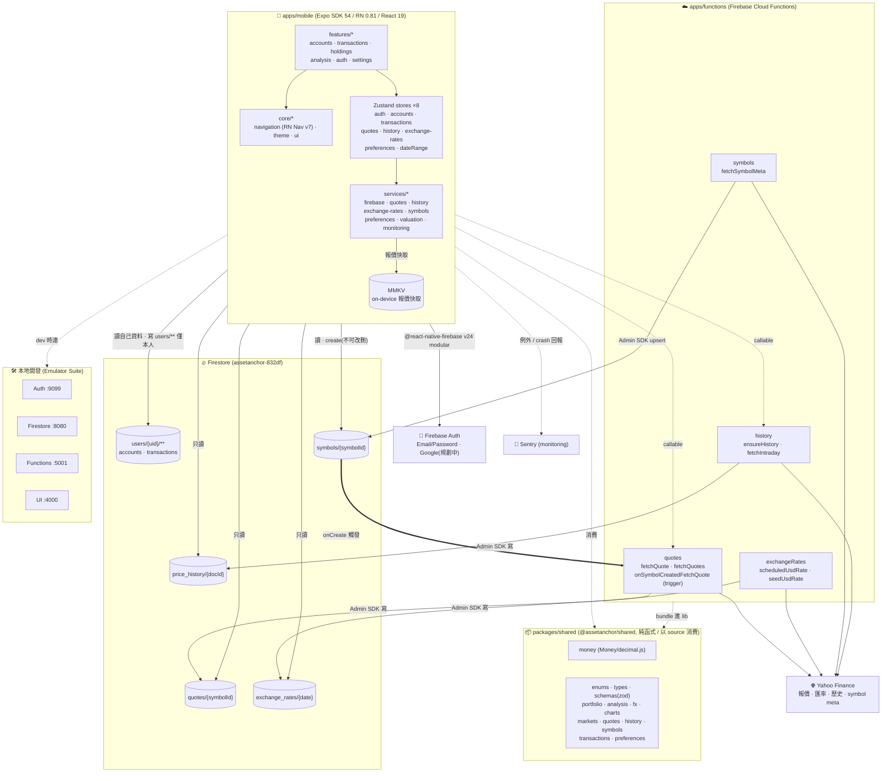
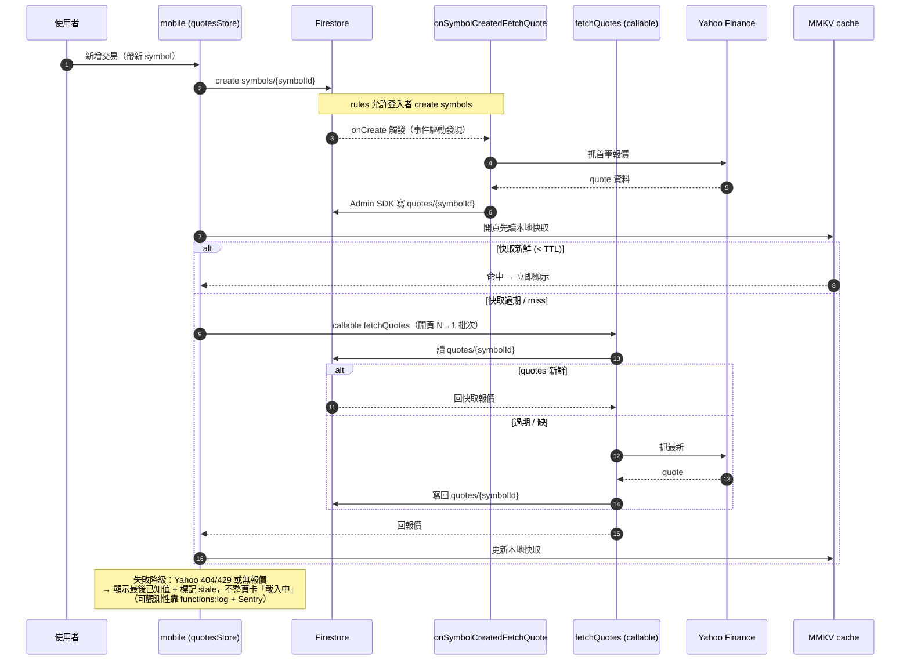

# AssetAnchor 架構總覽（Top-view）

> **本圖為導覽，權威仍是 code。** 目的是讓 LLM 與人類工程師一眼掌握元件、資料流與信任邊界，好評估新功能落在哪一層。細節以 `apps/`、`packages/shared/src/`、`apps/functions/src/`、`firebase/firestore.rules` 為準；衝突時以 code 為準並回頭修本圖。
>
> 相關權威文件：`docs/portfolio_tracker_planning.md`（§6 schema 聖牛）、ADR-0004（event-sourcing schema）、ADR-0005（單幣別事件＋顯示換算）、ADR-0006（報價雙層 cache）、ADR-0010（走勢圖歷史架構）、CLAUDE.md（憲法 + DoD）。

## 圖一：元件拓樸（前後端 / DB / cache / auth / external / dev）

**信任邊界（Firestore rules，`firebase/firestore.rules`）**：

| 集合                    | client 讀 | client 寫                             | 寫入者                  |
| ----------------------- | --------- | ------------------------------------- | ----------------------- |
| `users/{uid}/**`        | 僅本人    | 僅本人                                | client（per-user 隔離） |
| `symbols/{symbolId}`    | 登入者    | **只能 create**（不可 update/delete） | client + 後端 upsert    |
| `quotes/{symbolId}`     | 登入者    | ❌                                    | **後端 Admin SDK only** |
| `exchange_rates/{date}` | 登入者    | ❌                                    | **後端 Admin SDK only** |
| `price_history/{docId}` | 登入者    | ❌                                    | **後端 Admin SDK only** |

**分層與依賴方向**：`features/* → core | services | packages/shared`；feature 之間不互 import。金額/數量/匯率/成本一律走 `shared` 的 `Money`（decimal.js），Firestore 存 10 位小數 string（ADR-0005）。

## 圖二：報價取得流程（最非直覺、最常出 bug 的 path）

> 為何挑這條：報價牽涉 client→trigger→外部 API→後端寫→client 讀回→快取的長鏈，且對「標的市場/代號」敏感（例：台股 ETF 若 market 存成 US → Yahoo 404 → 前端永遠「報價載入中」）。理解這條就理解了整個非同步真值鏈。

**降級與可觀測性**：報價鏈任一環失敗都不應讓持股頁整頁卡在「報價載入中」；應退回最後已知值並標 stale。client 端錯誤能見度有限，後端問題主要靠 `firebase functions:log` 與 Sentry（見 memory：prod 台股 ETF market=US → Yahoo 404 案例）。
