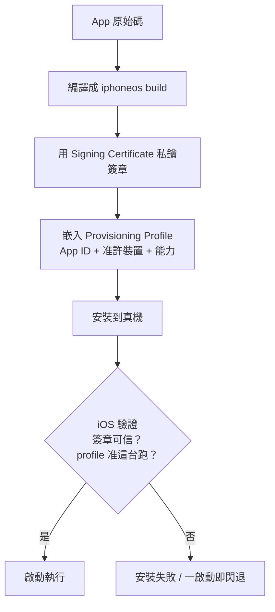
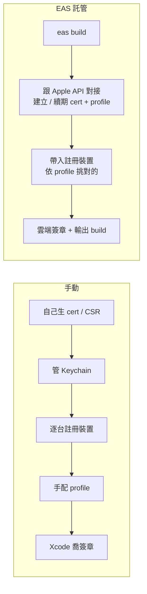

# iOS Code Signing 與 EAS 託管

> 起源：AssetAnchor Sprint 1 T9（真機 EAS demo）討論中，「EAS 幫你託管 cert 與 profile，不用自己跟憑證搏鬥」這句話的名詞需要補齊——iOS code signing 是什麼、由哪些零件組成、為什麼手動管很痛、EAS 託管具體幫掉了什麼。

## TL;DR

- iOS 規定**任何要在真機上跑的 app 都必須簽章**，證明兩件事：「是哪個被 Apple 認證的開發者做的」＋「准不准在這台手機上跑」。模擬器不需要（跑在已信任的 Mac 上）。
- 機制由五個零件組成：Apple Developer Program、Signing Certificate、App ID、Device 註冊、Provisioning Profile。
- 手動管理的痛點：自己生私鑰 / CSR、匯入 Keychain、逐台註冊裝置、配對 cert + profile，且全會過期（免費帳號 cert 只有 7 天），換機 / 協作時私鑰難搬。
- **EAS 託管**：把憑證與 profile 集中加密保管，`eas build` 時自動跟 Apple 對接建立 / 續期 / 挑選並在雲端簽章。你只做互動授權（login / 授權 Apple / 註冊裝置）。

## 一、為什麼 iOS 要簽章

這是 Apple 的安全機制：防止來路不明的 app 在裝置上執行、並讓每個 app 都能追溯到一個負責的開發者。因此凡是要裝到真 iPhone 上的 app，都得用開發者憑證簽章，讓 iOS／Apple 能驗證它的來源與執行授權。模擬器則跑在你已信任的 Mac 上，不要求簽章——這也是為什麼 **Simulator build 與真機 build 是兩種不同的編譯產物**。

## 二、組成的五個零件

| 術語                            | 白話                                                    | 作用                                                                                                     |
| ------------------------------- | ------------------------------------------------------- | -------------------------------------------------------------------------------------------------------- |
| **Apple Developer Program**     | 開發者會員（$99／年）                                   | 信任的根；憑證、App ID 都掛在你帳號下。真機發佈 / TestFlight / 上架都需要                                |
| **Signing Certificate**（cert） | 你的數位簽章身分（私鑰 + Apple 簽發的公開憑證）         | 用私鑰幫 app 二進位檔蓋章，證明「這是這個被 Apple 認證的開發者做的」。分 Development / Distribution 兩種 |
| **App ID**                      | app 的身分（綁 bundle id `com.seanwangys.assetanchor`） | 標明這是哪個 app + 宣告它能用哪些能力（推播等）                                                          |
| **Device 註冊**（UDID）         | 准許安裝的真機清單                                      | development / ad-hoc 時 Apple 要知道准哪幾台手機（每年約 100 台／類上限）；App Store 版不需要            |
| **Provisioning Profile**        | 通行檔（`.mobileprovision`）                            | 把上述綁成一張：「這個 App ID + 由這張 cert 簽 + 准在這些裝置跑 + 這些能力」，build 時嵌進 app           |

## 三、安裝 / 啟動時 iOS 怎麼驗

安裝或啟動時，iOS 會檢查 app 內嵌的 provisioning profile 與簽章：

模擬器這條完全跳過，所以 Simulator build 不能拿來裝真機。

## 四、手動管理的痛點（「跟憑證搏鬥」）

- 產 cert：生私鑰 + CSR → 上傳 Apple → 下載憑證 → 匯入 Mac 的 Keychain
- 註冊 App ID、逐台登記裝置 UDID
- 依用途（development / ad-hoc / App Store）各做一張對的 provisioning profile、下載，並確保 Xcode 抓到正確的 cert + profile 配對
- **全部會過期**：付費 cert 1 年、免費帳號 cert 只有 7 天；profile 也會過期
- 多加一台裝置 → 要重做 profile
- 換電腦 / 多人協作 → 私鑰卡在某台 Mac 的 Keychain，搬移麻煩
- 配錯就噴難解的錯：`No matching provisioning profile`、`Code signing identity not found`

## 五、EAS 託管做了什麼

- 把**簽名憑證（私鑰）+ provisioning profiles 集中加密保管**在你的 Expo 帳號
- 每次 `eas build` 自動：該建的 cert / profile 建、該續的續、把註冊裝置帶進 profile、依 build profile（development / preview / production）挑對的來簽——整段在雲端完成
- 你不碰 Keychain、不下載 `.mobileprovision`、不在 Xcode 喬簽章
- 私鑰不再綁死單一台 Mac → 換機 / CI / 沒 Mac 都能 build

## 六、對 AssetAnchor T9 的實際意思

- 真機 build 是**另一種編譯產物**（iphoneos + 簽章），不是把 Simulator 上那份拷過去
- 走 EAS 時你只需做互動授權：`eas login`、用 Apple 帳號授權一次、`eas device:create` 把手機加進名單；cert / profile 的繁瑣全交給 EAS
- 因為 `ios/` 是 config plugin 生成（gitignored），EAS 在雲端會從 `app.config.ts` 重跑 prebuild → build 可重現，且會吃到 `forceStaticLinking` 那個修正

## 速查表

- **Code signing**：用開發者憑證幫 app 二進位檔蓋章，iOS 才信任它在真機跑
- **Signing Certificate**：證明「誰做的」；免費帳號 7 天、付費 1 年
- **App ID**：這是哪個 app（綁 bundle id）+ 能用哪些能力
- **Device 註冊**：development / ad-hoc 才需要，列出准裝的真機
- **Provisioning Profile**：把 App ID + cert + 裝置 + 能力綁成一張、嵌進 app 供 iOS 驗
- **EAS 託管**：集中保管憑證 / profile + 雲端自動建 / 續 / 簽，人只做互動授權

## 參考案例

- AssetAnchor Sprint 1 — T9 真機 EAS demo（本筆記的起源討論）
- `apps/mobile/app.config.ts`：`forceStaticLinking` 修正（commit `d4de568`），EAS 雲端 prebuild 會吃到
- 待辦：建 `eas.json`（development / preview / production profiles）+ `.easignore`（處理 gitignored 的 `GoogleService-Info.plist`）
