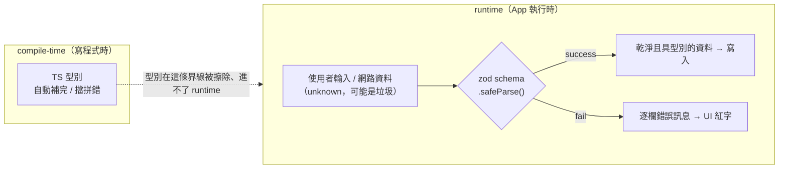

# zod schema 與「隔離 ≠ 欄位驗證」— 技術筆記

> **建立日期**：2026-06-07
> **情境**：AssetAnchor Sprint 2（Accounts）的 `design.md` 寫了一句取捨——「Rules 只保證隔離、不驗欄位 → 欄位完整性靠 client zod schema；對個人 App 可接受，rules 維持簡潔四條」。本筆記拆解這句話背後的兩個核心觀念：(1) schema / zod 是什麼、為什麼 TypeScript 型別不夠用；(2) 「隔離」與「欄位完整性」是兩個獨立的安全性質，以及為什麼這個專案刻意只在 client 端驗欄位。
> **來源**：學習對話整理 + 本專案 `firebase/firestore.rules`、`packages/shared/src/types/account.ts`、`openspec/changes/add-account-management/design.md`。
> **相關**：`docs/tech_note/firestore-security-rules.md`（rules 為何是唯一安全邊界、怎麼運作、怎麼測）。

---

## TL;DR

**TypeScript 型別只活在 compile-time，程式一跑起來就被擦掉、對 runtime 的爛資料毫無防護。** zod 是一個函式庫，讓你用一份 schema **同時**得到「runtime 守門員」和「compile-time 型別（`z.infer`）」，規則只有一個來源。

另一條軸線：「這資料安全嗎」要拆成獨立的性質。本專案的 Firestore rule `match /users/{userId}/{document=**}` 把 **隔離（誰能碰）** 守得很死（A 永遠碰不到 B），但**完全不驗欄位（資料長得對不對）**——擁有者可以把任意垃圾寫進自己的子樹。設計上**刻意**把欄位驗證只放在 client zod，rules 維持簡潔，因為以「個人自用 App」的**威脅模型**來看，「弄爛自己被隔離鎖住的資料」是低風險、不值得用「rules 變複雜 + 邏輯重複兩份」的高成本去防。重點是：這是**寫進文件的有意識取捨**，不是疏忽。

---

## 1. schema / zod：為什麼 TypeScript 型別不夠用

**schema = 一份「合法資料長什麼樣」的正式規格**：要有哪些欄位、什麼型別、什麼限制。

專案已有的 `AccountDocument`（`packages/shared/src/types/account.ts`）是 **TypeScript 型別**。但關鍵事實是：

> **TS 型別只存在於 compile-time；程式真正執行（runtime）時，型別已被擦除、完全不存在。**

所以 `account_name: string` 擋不住使用者送出空字串——因為 `""` 也是合法的 `string`。當**使用者在表單亂打**、或**從網路收到一包資料**時，型別幫不上忙，你需要在 runtime 真的去「檢查」。

**zod** 就是補這個洞的函式庫，一份 schema 給你兩樣東西：

1. **Runtime 驗證**：執行時真的檢查一筆資料、不合法就指出「哪個欄位、錯在哪」。
2. **靜態型別**：用 `z.infer` 從同一份 schema 自動推導 TS 型別，不用手寫第二份。

```typescript
import { z } from 'zod';
import { BROKERS } from '../enums/brokers.js';
import { ACCOUNT_TYPES } from '../enums/account-types.js';

export const accountInputSchema = z.object({
  account_name: z.string().trim().min(1, '帳戶名稱必填'),
  broker: z.enum(BROKERS),
  account_type: z.enum(ACCOUNT_TYPES),
  base_currency: z.enum(['USD', 'TWD']), // MVP 只收這兩種
  color: z.string().regex(/^#[0-9A-Fa-f]{6}$/, '需為 #RRGGBB 色碼'),
});

export type AccountInput = z.infer<typeof accountInputSchema>; // 型別免費推導

// 使用：
const result = accountInputSchema.safeParse(formData);
if (!result.success) {
  // result.error → 每個欄位的錯誤訊息 → 表單紅字
} else {
  // result.data 是「保證合法、型別正確」的 AccountInput → 才放行寫入
}
```



**一句話**：型別 ≠ 驗證。型別是 compile-time 的提示、runtime 會消失；zod 是 runtime 的保全，還順手給你型別。規則只有一個來源（single source of truth），不會兩邊對不上。

**比喻**：TS 型別像門口貼的「入場資格說明」（紙上寫寫、沒人執行）；zod 是真的站在門口查證件的保全。

---

## 2. 「隔離」與「欄位完整性」是兩個獨立的安全性質

「這資料安全嗎」會拆成好幾個彼此獨立的性質。針對本專案的核心 rule：

```javascript
match /users/{userId}/{document=**} {
  allow read, write: if request.auth != null
                     && request.auth.uid == userId;
}
```

| 安全性質                                | 它在問什麼               | 這條 rule 有做嗎                                                        |
| --------------------------------------- | ------------------------ | ----------------------------------------------------------------------- |
| **隔離 (Authorization / Isolation)**    | **誰**可以碰這筆資料？   | ✅ **有**。A 永遠只能碰 A 的，碰不到 B 的；就算 client 被改造也擋得住。 |
| **欄位完整性 (Validation / Integrity)** | 這筆資料**長得對不對**？ | ❌ **沒有**。                                                           |

`{document=**}` 萬用字元 + `allow write: if (是擁有者)` 的語意是：**只要你是擁有者，可以寫進字面上任何東西**。下面這筆爛資料 rule 照單全收：

```javascript
{
  account_name: "",                 // 空名稱
  base_currency: "DOGECOIN",        // 非法幣別
  color: 12345,                     // 連型別都錯
  cash_balances: { "USD": "abc" },  // 不是數字
  亂加的欄位: true
}
```

所以那句話的完整意思是：**rule 保證「你只能動自己的資料」（隔離），但不保證「資料長得對」（欄位完整性）——這兩件事互相獨立，簡單的萬用規則只給了第一件。**

---

## 3. 設計取捨：威脅模型決定「驗證放哪裡」

### 理想：兩邊都驗（defense in depth）

- **Client 驗（zod）**：給使用者即時友善回饋；但 client 可被繞過（改 App、直接打 API）。
- **Server 驗（Firestore Rules 其實做得到）**：才是擋得住的邊界。Rules 可以寫 `request.resource.data.base_currency in ['USD','TWD']`。

### 本專案為何「故意只在 client 驗」

|                  | 在 Rules 也驗欄位                            | 只在 client zod 驗                                 |
| ---------------- | -------------------------------------------- | -------------------------------------------------- |
| **成本**         | rules 又臭又長；驗證邏輯重複兩份、要同步維護 | rules 維持簡潔四條；邏輯一份                       |
| **被接受的風險** | —                                            | 被改造的 client 可能把爛資料寫進**自己**的子樹     |
| **風險的天花板** | —                                            | 只能弄爛**自己**的資料，**碰不到別人**（隔離還在） |

### 關鍵觀念：威脅模型 (threat model)

安全決策要對著**你的威脅模型**做，不是無腦套最高規格：

- **銀行 / 多租戶 SaaS**（陌生人共用一個 DB）→ **非得**在 server 驗欄位，因為爛資料會傷到別人、會被惡意利用。
- **個人自用 App**（AssetAnchor）→ 現實的「攻擊者」幾乎是你自己；「弄爛自己、且被隔離鎖死在自己帳號內的資料」是低風險。為它付「rules 複雜化 + 邏輯重複」的高成本不划算。

這就是計劃書「rules 簡潔到只有四條」的由來——**對著威脅模型做的刻意簡化**。

---

## 4. 具體會出什麼事（讓觀念有感）

假設未來某 bug 讓 App 寫進 `cash_balances: { "USD": "abc" }`：

1. Rules **照收**（不驗欄位）。
2. 之後 Money 解析 `"abc"` → **crash**。
3. 但這包爛資料只在**你自己**帳號裡、只有你會 crash → **被隔離鎖住、不擴散**。

→ 這就是「個人 App 可接受」的具體含義。換成多租戶，第 3 點的「不擴散」就不成立，結論就會反過來。

**為什麼要把這句話寫進 design.md**：因為它是**決策、不是疏忽**。白紙黑字寫下，是讓未來的你（或開源貢獻者）知道「rules 不驗欄位是想清楚後選的」；哪天變多使用者或要更硬的防護，**這一行就是要回來補的清單項**。

---

## 5. 速查表

- **型別 ≠ 驗證**：TS 型別是 compile-time、runtime 會被擦除；zod 是 runtime 守門員，並用 `z.infer` 順帶給型別。
- **zod 的價值**：一份 schema = runtime 驗證 + 靜態型別，single source of truth。`safeParse` 回 `{success, data | error}`。
- **安全要拆開看**：隔離（誰能碰）與 欄位完整性（長得對不對）是獨立性質；一個機制通常只罩其中幾個。
- **本專案 rule**：`users/{userId}/{document=**}` 守住隔離、不驗欄位 → 擁有者可寫任意垃圾進自己子樹。
- **取捨**：欄位驗證只放 client zod、rules 維持簡潔；理由是個人 App 的威脅模型下，弄爛自己被隔離的資料屬低風險。
- **威脅模型**：安全決策對著實際風險做，不是越嚴越好；多租戶/金融場景則必須 server 端驗欄位。

---

## 參考

- 本專案 rules：`firebase/firestore.rules`
- 帳戶型別：`packages/shared/src/types/account.ts`；Sprint 2 zod schema（待建）：`packages/shared/src/schemas/account.ts`
- 設計取捨出處：`openspec/changes/add-account-management/design.md`（Risks / Trade-offs）
- 姊妹篇：`docs/tech_note/firestore-security-rules.md`
